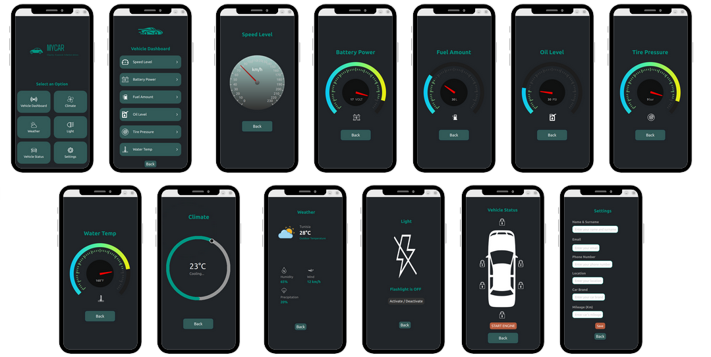

# 🚗 QT Application


## Table of Contents

- [📌 Project Overview](#-project-overview)
- [🗂️ GitLab Group Structure](#-gitlab-group-structure)
- [📁 Directory Structure](#-directory-structure)
- [🏗️ Project Architecture](#%EF%B8%8F-project-architecture)
- [⚙️ Technologies Used](#-technologies-used)
- [🛠️ Prerequisites](#-prerequisities)
- [🔗 Download Qt Creator ](#-download-qt-creator)
- [🧰 Manual Installation of Qt 5](#-manual-installation-of-qt-5)
- [📦 Installing Required Qt Modules](#-installing-required-qt-modules)
- [📈 Results](#-resultat)
- [🔧 Usage](#-usage)
- [🔮 Future Considerations](#-future-considerations)
- [🤝 Contributing](#-contributing)
- [👨‍💻 Project By](#project-by)

## 📌 Project Overview  

### 📚 Background:

This project, developed by Farah Elloumi as part of their professional work at Primatec Engineering, focuses on vehicle Data Tracking for system analysis and troubleshooting. Additionally, it utilizes these results to predict the anomalies in the vehicle. The solution is containerized with Docker, automated using GitLab CI and deployed using Kubernetes with Argo CD for continuous deployment.

### 🌟 The project must include:

- **✅ Real-Time Data Processing**:
  - Utilizes gRPC for real-time communication between the Android diagnostic app and the server.
  - Ensures seamless data transmission and processing for vehicle diagnostic data to detect issues and provide insights.

- **📊 Dynamic Visualization**:
  - Builds a real-time dashboard within the app to monitor vehicle health, displaying key metrics such as engine status, fuel efficiency, and error codes.
  - Provides visual representations of system performance, assisting users in decision-making for maintenance or repairs.

- **🛡️ Security and Vulnerability Scanning**: 
  - Ensure code, secrets, and container images are secure by identifying and mitigating vulnerabilities during the CI/CD pipeline.

- **✅ Automated Testing**: 
  - Automatically test all changes to ensure functionality and stability.

- **🐳 Dockerization**: 
  - Build the android application into portable Docker images.

- **☸️ Kubernetes Deployment**: 
  - Deploy services seamlessly across devolepment environments using Kubernetes clusters.

- **🔄 Integration Testing**: 
  - Validate the functionality and reliability of all services after deployment.

- **🚀 Argo CD for Continuous Delivery**:

  - Implement Argo CD to automate the deployment process, ensuring fast and reliable updates across environments.

  - Use Argo CD to manage Kubernetes resources, monitor application health, and rollback to previous versions if necessary for smooth and consistent updates.

- **🛠️ Scalable and Extensible Architecture**:
  - Employs a modular design, separating vehicle data collection, analysis, and visualization components for flexibility and scalability.
  - Allows for the integration of new diagnostic tools and data sources to support future enhancements and additional vehicle types.


## 🗂️ GitLab Group Structure

```plaintext
grpc-application-communication/
│
├── diagnostic-app/
│      
├── grpc_client/
|     
├── grpc_server/
|
└── QT Application/
```

## 📁 Directory Structure

```plaintext
QT Application/
│
├── QT_APP_QML.pro                  # Project file for configuring and building the Qt QML application
|
├── Sources/
|   ├── main.cpp                    # C++ file that initializes the Qt application and loads the QML interface             
|
├── Ressources/
|   ├── qml.qrc                     # Resource file for including QML files and other resources in the application
|
|   ├── assets/
│   |   ├── car_logo.svg            # Car Logo
|   │   ├── car_outline.svg         # Car Outline Logo
|   │   ├── chevron-right.svg       # Chevron Right Icon
|   │   ├── Climate.svg             # Climate Icon
|   │   ├── fuel.svg                # Fuel Icon
|   │   ├── humidity_icon.svg       # Humidity Icon
|   │   ├── ic_battery.svg          # Battery Icon
|   │   ├── ic_flashlight.svg       # Flash Light Icon
|   │   ├── ic_flashoff.svg         # Flash Off Icon
|   │   ├── ic_flashon.svg          # Flash On Icon
|   │   ├── ic_lock_green.svg       # Lock Green Icon
|   │   ├── ic_lock_red.svg         # Lock red Icon
|   │   ├── ic_oil.svg              # Oil Icon
|   │   ├── ic_sensors.svg          # Sensors Icon
|   │   ├── ic_settings.svg         # Settings Icon
|   │   ├── ic_speed.svg            # Speed Icon
|   │   ├── ic_status.svg           # Status Icon
|   │   ├── logo.svg                # Application Logo
|   │   ├── needle.svg              # Needle Icon
|   │   ├── precipitation_icon.svg  # Precipitation Icon
|   │   ├── temperature.svg         # Temperature Icon
|   │   ├── tire.svg                # Tire Icon
|   │   ├── weather_sunny.svg       # Weather Sunny Icon
|   │   ├── weather.svg             # Weather Icon
|   │   ├── wind_icon.svg           # Wind Icon
|   │   ├── values.json             # Values file providing diagnostic data to the Qt application
│      
|   ├── BatteryPage.qml             # QML file for displaying the battery gauge
|   ├── ClimatePage.qml             # QML file for displaying the climate gauge
|   ├── FuelPage.qml                # QML file for displaying the fuel gauge
|   ├── HomePage.qml                # QML file for displaying the home page
|   ├── LightPage.qml               # QML file for displaying the light page
|   ├── main.qml                    # QML file for displaying the main page to initialize all components
|   ├── OilPage.qml                 # QML file for displaying the oil gauge
|   ├── SensorsPage.qml             # QML file for displaying the sensors page
|   ├── SettingsPage.qml            # QML file for displaying the settings page
|   ├── SpeedPage.qml               # QML file for displaying the speed gauge
|   ├── StatusPage.qml              # QML file for displaying the status page
|   ├── TirePage.qml                # QML file for displaying the tire pressure gauge
|   ├── WaterPage.qml               # QML file for displaying the water temperature gauge
|   └── WeatherPage.qml/            # QML file for displaying the weather page
```

This guide will walk you through the process of building Qt Application developed using QML.

## 🏗️ Project Architecture

### Global Architecture


🔍 **How it Works:**
1. **Embedded Communication**: Two STM32 microcontrollers communicate using the CAN protocol, enabling data exchange between the embedded components.
2. **USB Data Transmission**: The STM32_2 microcontroller transmits diagnostic data to the host machine via USB communication.
3. **gRPC Client-Server Model**: A gRPC client running on the host machine forwards requests to a gRPC server hosted in an Android Virtual Machine (VM) for processing.
4. **Response Handling**: The gRPC server processes the request and returns a response to the gRPC client, completing the diagnostic workflow.
5. **QT Application Integration**: The architecture allows for integration with a QT-based application for enhanced data visualization and user interaction.

## ⚙️ Technologies Used
| Component            | Technology                          |
|-----------------------|-------------------------------------|
| **Diagnostic Application**         | Kotlin                             |
| **QT Application**         | QML                          |
| **Container Management** | Docker                             |
| **CI/CD**   | GitLab CI, ArgoCD (GitOps-based CD)                           |  
| **Orchestration**   | Kubernetes                           |  

## 🛠️ **Prerequisites** 

To successfully set up and run your C++ binary with gRPC on the Android VM, you'll need the following tools and requirements:

### 🧰 **System Requirements**:
- **OS**: Ubuntu 20.04+ 
- **Disk space**: 400 GB+ free
- **RAM**: 16 GB minimum
- **Tools**:
  - **Git**
  - **Python**
  - **Repo**
  - **OpenJDK (11 or 17)**

## 🔗 **Download Qt Creator**:

### **1. Download the Official Installer**:
Go to the official Qt website to download the open-source installer:

🔗 [Download Qt Online Installer](https://www.qt.io/download-qt-installer-oss)

Click on **"Download Qt Online Installer for Linux"** to retrieve a `.run` (executable) file.

### **2. Make the File Executable**:

Open a terminal in the directory where you downloaded the file (e.g., `~/Downloads`) and type:

```bash
chmod +x qt-online-installer-linux-x64-4.9.0.run
```
Replace the filename with the exact name if it's different. Press Tab for autocomplete.

### **3. Run the Graphical Installer**:
Still in the terminal:
```bash
./qt-online-installer-linux-x64-4.9.0.run
```
The Qt installation interface will open. It may take a few seconds.

### **4. Follow the Installation Steps**:
1. **Login required** with your Qt account (even for the free version).

2. Select the desired Qt version (e.g., **Qt 6.6**).

3. Check **Qt Creator** to install the development environment (IDE).

4. Complete the installation.

### **5. Launch Qt Creator**:
After installation, you can launch Qt Creator with:
```
qtcreator
```
Or from your application menu depending on your desktop environment.

## 🧰 **Manual Installation of Qt 5 (Alternative)**

If you prefer a manual installation or face issues with the graphical installer, you can install Qt through your distribution’s packages.
### **Step 1: Install the Required Packages:**
```
sudo apt install qtbase5-dev qtchooser qt5-qmake qtbase5-dev-tools
```
This installs:

- qmake (Qt build tool)

- The libraries necessary for Qt Widgets applications

### **Step 2: Verify qmake is Working**
```
qmake -v
```
Expected output:
```
Using Qt version 5.x.x in /usr/lib/x86_64-linux-gnu
```
### **Step 3: Configure in Qt Creator**

1. Open Qt Creator
2. Go to Tools > Options > Kits
3. Check if a Desktop Kit with Qt 5.x and GCC is detected.
4. If not, add a kit:
    - Qt version: /usr/lib/x86_64-linux-gnu/qt5/bin/qmake
    - Compiler: GCC (usually detected if you have build-essential)

## 📦 **Installing Required Qt Modules**

The modules you need for your QML project are typically included with the Qt installation, but here’s how you can ensure they are available and install them manually if necessary.
Required Modules:

- QtQuick 2.15

- QtQuick.Controls 2.15

- QtQuick.Layouts 1.15

- QtGraphicalEffects 1.15

- QtQuick.Shapes 1.15

- QtQuick.LocalStorage 2.0

**Steps to Install Missing Modules:**

If you used the Qt Online Installer, these modules should be included by default. However, if you need to install them manually via apt, you can use the following commands (note that some modules might not be directly available in certain distributions’ repositories, and you might need the Qt installer to install them):
```
sudo apt install qml-module-qtquick-controls2 qml-module-qtquick-layouts qml-module-qtgraphicaleffects qml-module-qtquick-shapes qml-module-qtquick-localstorage
```
This will install the necessary modules to run your QML project with the specified components.

## 📈 **Results**
**Qt Application**



## 🔧 **Usage**
**Prerequisites**
- Qt Creator installed in the host machine.

**Steps to Run**

**Clone the Repository**

    ```bash
    git clone https://gitlab.com/grpc-application-communication/qt-application.git

    cd qt-application
    ```

## 🔮 Future Considerations
1. Enhancement of the Qt application to improve performance and user experience.  
2. Continuous development of new features to expand functionality and usability.  
3. Optimization of the CI/CD pipeline for faster and more efficient deployments.  
4. Exploration of additional integrations to enhance scalability and security.  

## 🤝 Contributing
We welcome contributions to enhance this project! Here's how you can get involved:

1. Fork the repository.
2. Create a new branch for your feature or bug fix.
3. Commit your changes.
4. Open a pull request with a detailed description.

## 👨‍💻 Project By
<a href="https://github.com/faraheloumi/AOSP-gRPC-DiagnosticApplication-Kotlin-Docker-GitLabCI-Kubernetes-ArgoCD/graphs/contributors">
    
</a>